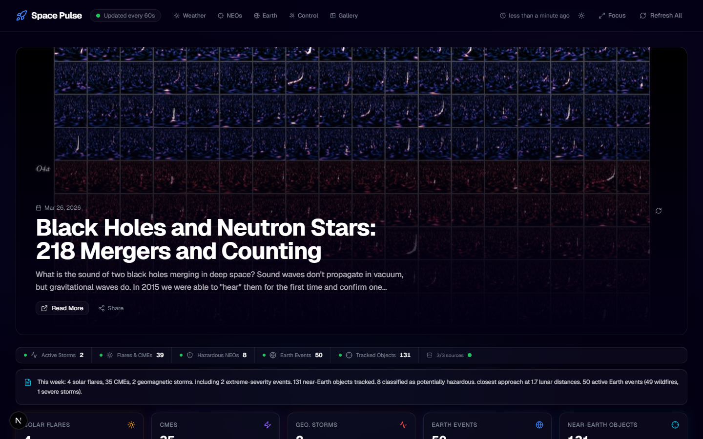
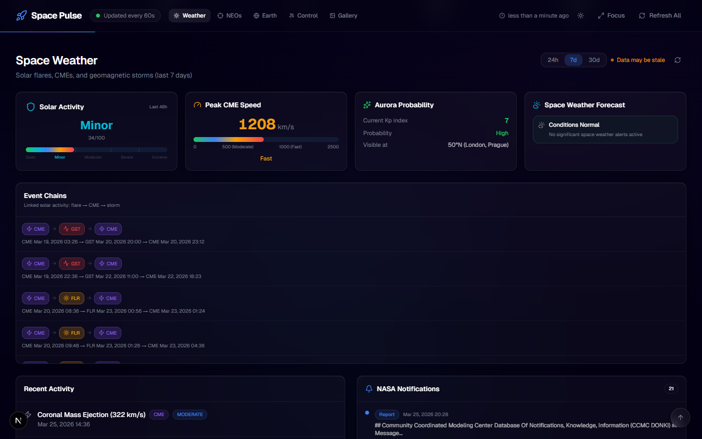
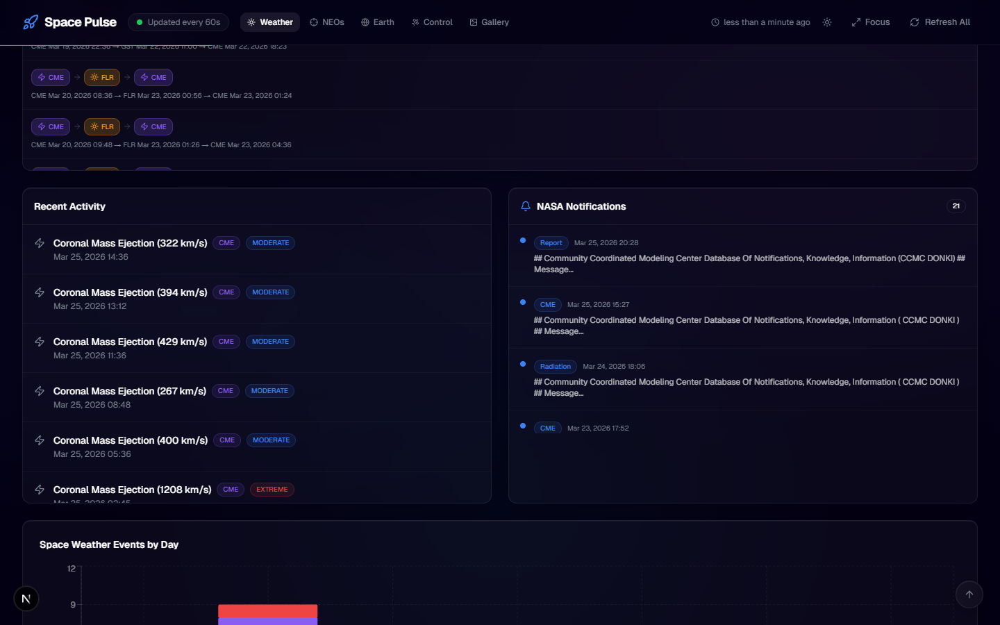
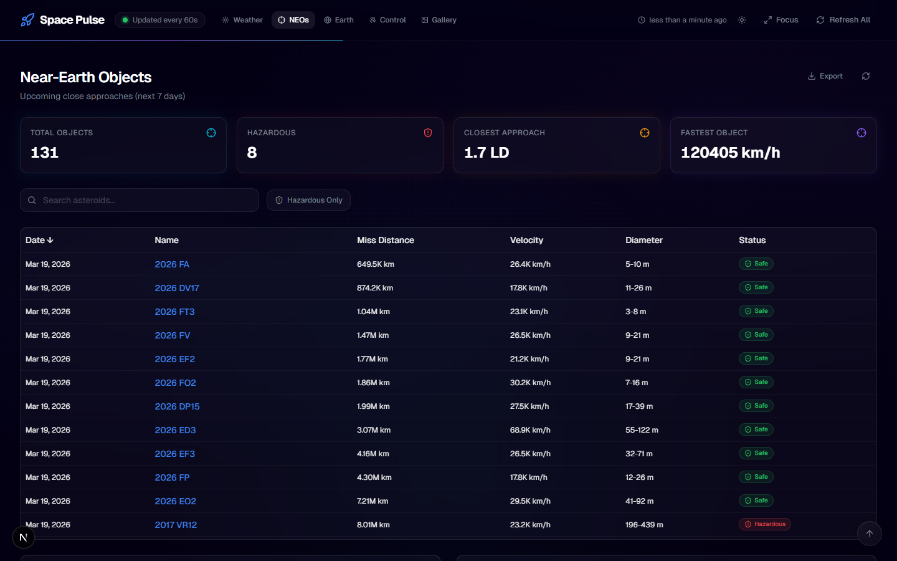
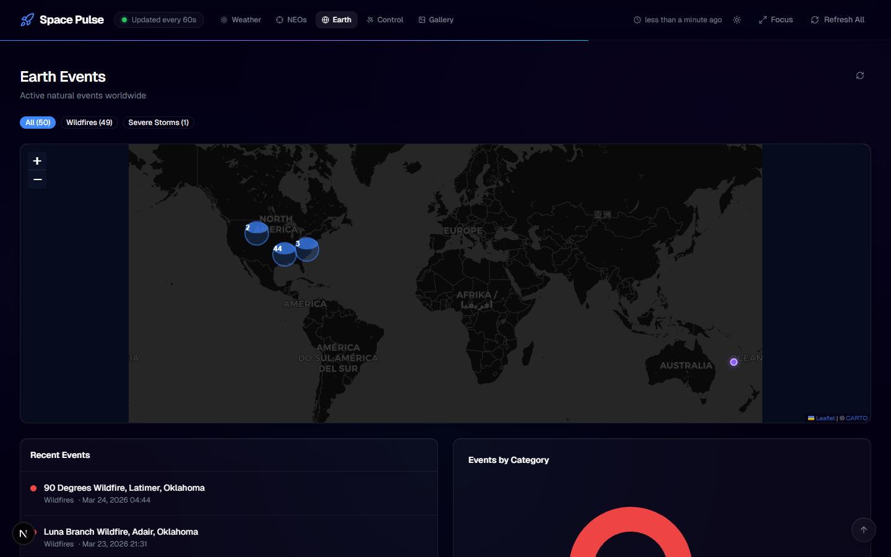
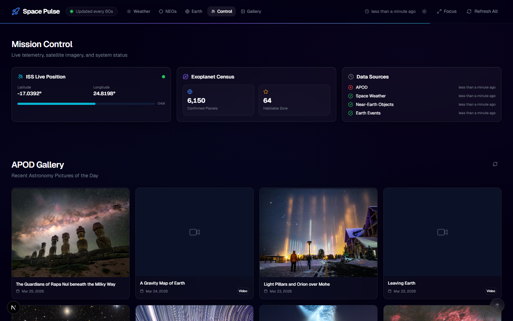
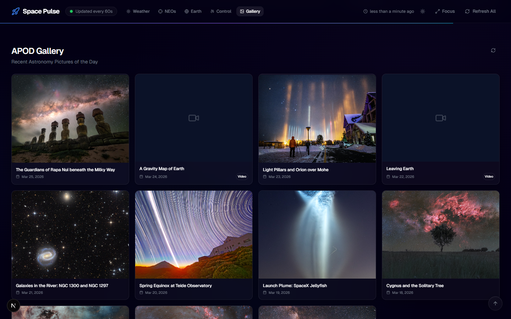
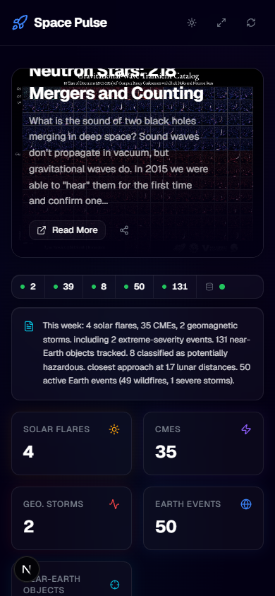

# Space Pulse

A production-grade NASA activity dashboard that aggregates real-time data from multiple NASA APIs into a cinematic, responsive interface. Built with resilient architecture, server-side caching, and graceful degradation.

**[Live Demo](https://space-pulse.vercel.app/)**



## Features

### Space Weather Intelligence
Real-time solar activity monitoring with threat level assessment, CME speed tracking, aurora probability, and NASA notification feeds. Supports 24h / 7d / 30d time windows with server-side filtering.





### Near-Earth Object Tracker
144+ asteroids tracked with sortable tables, hazard classification, risk ranking, orbital proximity visualization, and detailed approach modals with distance/size comparison graphics. Includes search and hazardous-only filtering.



### Earth Events Map
Interactive dark-themed Leaflet map with marker clustering, category filters, event detail drawers, and magnitude data. Powered by NASA EONET.



### Mission Control
Live ISS position tracking, DSCOVR EPIC satellite imagery, exoplanet census from NASA's archive, and real-time data source health monitoring.



### APOD Gallery & Mars Rover
Astronomy Picture of the Day gallery with HD image and video modals, plus latest Curiosity rover photos from the surface of Mars.



### Mobile Responsive
Every section adapts from desktop to mobile with cards replacing tables, stacked layouts, and touch-friendly controls.



## Tech Stack

| Layer | Technology |
|-------|-----------|
| Framework | Next.js 16 (App Router, Server Components) |
| Language | TypeScript (strict mode) |
| Styling | Tailwind CSS v4, shadcn/ui |
| Data Fetching | TanStack React Query |
| Charts | Recharts |
| Maps | React Leaflet, Leaflet MarkerCluster |
| Animations | Framer Motion |
| Validation | Zod |
| Icons | Lucide React |

## Architecture

```
Browser
  -> React Query hooks (60s auto-refresh)
    -> Internal API routes (/api/*)
      -> Service layer (orchestration + caching)
        -> Resilient fetch pipeline (dedup -> timeout -> retry -> circuit breaker)
          -> NASA APIs
```

### Backend

- **10 API routes** serving normalized, validated JSON
- **In-memory cache** with stale-while-error fallback (55s TTL, serves stale data on upstream failure)
- **Resilience pipeline**: 10s timeout, 2 retries with exponential backoff, per-module circuit breakers, request deduplication
- **Zod validation** on all upstream NASA responses
- **Mappers** transform raw API payloads into clean domain models
- **Graceful degradation**: one failed source never breaks the dashboard

### Frontend

- **Modular feature architecture**: each section is self-contained with its own hook, components, and state
- **Server state via React Query**: automatic background refresh, cache invalidation, stale indicators
- **Loading/error/empty states** for every section with polished skeleton shimmer animations
- **Light + dark theme** toggle with full glassmorphism support
- **Keyboard shortcuts**: `1-5` jump to sections, `0` scroll to top, `R` refresh all
- **PWA manifest** for installability

## Data Sources

| Source | API | What It Provides |
|--------|-----|-----------------|
| [NASA APOD](https://apod.nasa.gov/apod/) | Planetary/APOD | Astronomy Picture of the Day (image + video) |
| [NASA DONKI](https://kauai.ccmc.gsfc.nasa.gov/DONKI/) | DONKI | Solar flares, CMEs, geomagnetic storms, notifications |
| [NASA NeoWs](https://cneos.jpl.nasa.gov/) | NeoWs Feed | Near-Earth object close approaches |
| [NASA EONET](https://eonet.gsfc.nasa.gov/docs/v3) | EONET v3 | Earth natural events (wildfires, storms, etc.) |
| [NASA EPIC](https://epic.gsfc.nasa.gov/) | EPIC | Full-disk Earth imagery from DSCOVR satellite |
| [Mars Rover](https://mars.nasa.gov/msl/multimedia/raw-images/) | Mars Photos | Curiosity rover camera images |
| [Exoplanet Archive](https://exoplanetarchive.ipac.caltech.edu/) | TAP | Confirmed exoplanet statistics |
| ISS Position | Where The ISS At | Real-time International Space Station coordinates |

## Quick Start

```bash
# Clone
git clone <repo-url>
cd space-pulse

# Install
npm install

# Configure
cp .env.example .env.local
# Edit .env.local and add your NASA API key from https://api.nasa.gov

# Run
npm run dev
```

Open [http://localhost:3000](http://localhost:3000).

## Environment Variables

| Variable | Required | Description |
|----------|----------|-------------|
| `NASA_API_KEY` | Yes | Free API key from [api.nasa.gov](https://api.nasa.gov) |

## Project Structure

```
src/
  app/                    # Next.js App Router pages and API routes
    api/                  # 10 internal API endpoints
  components/
    ui/                   # shadcn/ui primitives
    layout/               # AppShell, Navbar, Footer
    shared/               # Reusable components (StatCard, badges, buttons, etc.)
    states/               # Loading skeletons, error states, empty states
    charts/               # Recharts wrapper components
    maps/                 # Leaflet map with marker clustering
  features/
    apod/                 # Hero section + gallery
    space-weather/        # Severity meter, CME gauge, aurora, timeline, notifications
    neos/                 # Table, risk ranking, orbit visualization, detail modal
    earth-events/         # Map, filters, event list, category chart
    dashboard/            # Status bar, digest, stats, data freshness
    iss/                  # ISS live tracker
    epic/                 # DSCOVR Earth imagery
    exoplanets/           # Exoplanet census
    mars/                 # Curiosity rover photos
  hooks/                  # React Query hooks, refresh, keyboard shortcuts
  lib/
    config/               # Environment validation, constants
    cache/                # In-memory cache with stale-while-error
    resilience/           # Timeout, retry, circuit breaker, deduplication
    observability/        # Structured logging, timing
    schemas/              # Zod schemas for NASA API validation
    nasa/                 # Fetchers, mappers, services
    api/                  # Typed client for internal API
    query/                # React Query client and key registry
  types/                  # TypeScript domain models
  styles/                 # Leaflet dark theme overrides
```

## Caching & Resilience

- **Cache TTL**: 55 seconds (aligned with 60s refresh interval)
- **Stale fallback**: on upstream failure, serves last known good data with `isStale: true`
- **Force refresh**: `?force=1` query parameter bypasses cache
- **Circuit breaker**: opens after 5 consecutive failures, recovers after 30s
- **Request dedup**: prevents duplicate in-flight requests to the same endpoint
- **Partial responses**: dashboard overview returns whatever sources succeed

## Theming

- **Dark mode** (default): deep space palette with nebula gradients and glassmorphism
- **Light mode**: clean light background with adjusted card shadows and borders
- Toggle via the sun/moon icon in the navbar

Colors defined as CSS custom properties in `src/app/globals.css`. Chart colors in `src/lib/config/constants.ts`.

## Adding New Modules

1. Define types in `src/types/`
2. Create Zod schema in `src/lib/schemas/`
3. Add fetcher in `src/lib/nasa/fetchers/`
4. Add mapper in `src/lib/nasa/mappers/`
5. Add service in `src/lib/nasa/services/`
6. Create API route in `src/app/api/`
7. Add query key in `src/lib/query/query-keys.ts`
8. Add client method in `src/lib/api/client.ts`
9. Create hook in `src/hooks/`
10. Build feature section in `src/features/`
11. Add to `DashboardContent`

## Scripts

```bash
npm run dev      # Development server (Turbopack)
npm run build    # Production build
npm run start    # Start production server
npm run lint     # ESLint
```

## License

MIT
